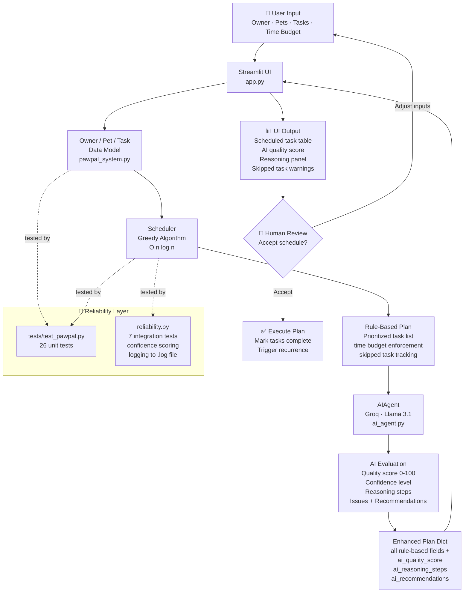

# PawPal+ System Architecture

## Data Flow Summary

| Stage | Component | Input | Output |
|-------|-----------|-------|--------|
| 1. Input | Streamlit UI | Owner name, pets, tasks, time | Owner/Pet/Task objects |
| 2. Schedule | Scheduler (greedy) | All incomplete tasks | Prioritized plan + skipped list |
| 3. Evaluate | AIAgent (Groq/Llama) | Rule-based plan + pet context | Quality score, reasoning, recommendations |
| 4. Display | Streamlit UI | Enhanced plan dict | Color-coded table, AI panel |
| 5. Review | Human | Schedule output | Accept or adjust inputs |
| 6. Test | pytest + reliability.py | Core classes + Scheduler | Pass/fail + confidence scores |

## Components

- **Owner / Pet / Task** — data model; composition hierarchy; JSON persistence
- **Scheduler** — greedy O(n log n) algorithm; prioritization, filtering, conflict detection
- **AIAgent** — sends plan to Groq (Llama 3.1), parses JSON response, returns AI fields
- **Streamlit UI** — user-facing interface; renders both rule-based and AI results
- **Human Review** — user accepts or adjusts the schedule (feedback loop)
- **Testing Layer** — 26 unit tests + 7 integration tests with confidence scoring and logging
